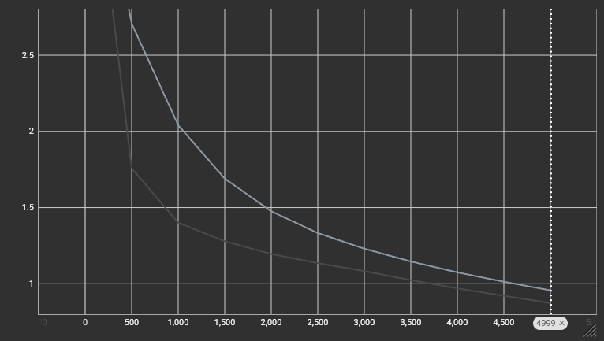
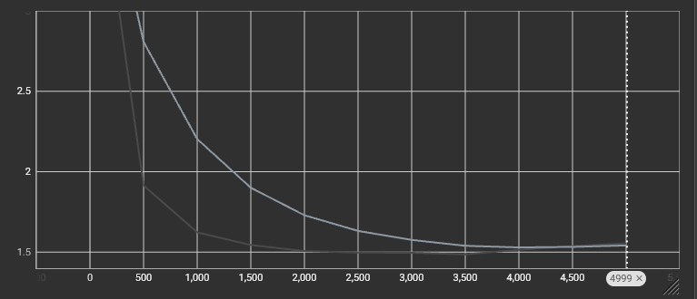
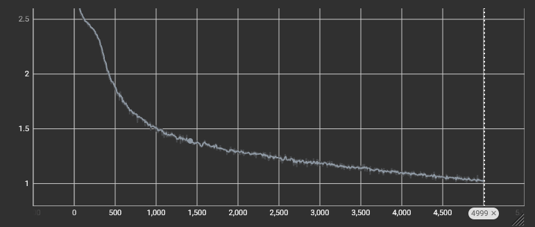
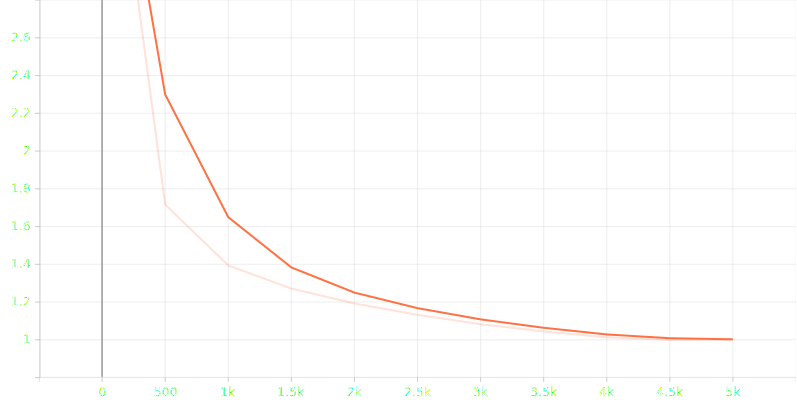
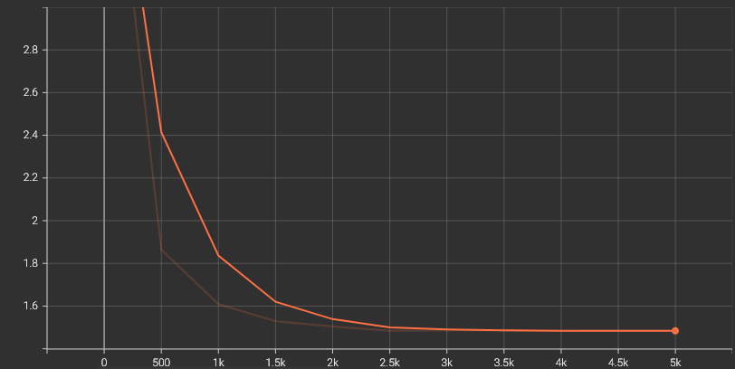

# Deploay-GPT
# 🧠 Mini-GPT – Character-Level Transformer on Shakespeare Data

A lightweight GPT-style decoder-only transformer trained from scratch on Shakespeare text.  
Implements: tokenization, transformer blocks, self-attention, positional embeddings, training loop, and text generation — all in pure PyTorch.
### Results
Not very meaningful right now because parameters are very low and the model was trained for very few iterations (GPU compute limitation).

---

### Goal
The goal here is to understand and implement a decoder only transformer **from scratch**.  
**More things will be applied and experimented with continuously.***


---

## 🚀 Features
- 🔡 Custom character-level tokenizer (JSON-saved + reloadable)
- 🧱 Decoder-only Transformer (GPT-mini architecture)
- 🧠 Multi-Head Self-Attention
- 📉 TensorBoard-logged training metrics
- 💾 Model + checkpoint + tokenizer saving
- ✍️ Text generation from promt 

---

## 🏗️ Model Architecture
| Component | Details |
|----------|---------|
| Type | Decoder-only Transformer |
| Layers | N attention blocks (configurable) |
| Embedding Dim | 384 |
| Attention Heads | multi-head |
| Optimizer | AdamW |
| Loss | Cross-Entropy |

## Hyperparamters
```python
batch_size    = 64
block_size    = 256
max_iters     = 5000
eval_interval = 500
learning_rate = 3e-4
eval_iters    = 200
n_embd        = 384
n_head        = 6
n_layer       = 6
dropout       = 0.2
device        = 'cuda' if torch.cuda.is_available() else 'cpu'
random_seed   = 1337
```

---

## 📊 Training Metrics

### 🔁 Training Loss Curve


### 📉 Validation Loss Curve


### 🪜 Per-Step Training Loss (Batch-level change)


<!-- <div align="center">
  
  
  
</div> -->

## 📊 Training Metrics after applying lr schedular and cosine weight decay
### Added Learning Rate Scheduler
### Added Gradinent Clipping 
### Early Stopping Criteria (Would be useful if iteration are increased to high numbers)

### Training Loss Curve


### Validation Loss Curve


### Per_step Training Loss Curve


> Loss steadily decreases → model is learning patterns from text.

## 🧪 Run Inference – Load Model & Generate Text

Below is a step-by-step example to load the trained GPT model, tokenizer, and generate text.

---

### 1️⃣ Load Model

```python
import torch
from model import GPTModel

device = 'cuda' if torch.cuda.is_available() else 'cpu'

model = GPTModel()
model.load_state_dict(
    torch.load("model_weights/gpt_model_state_2.pt")
)
model.to(device)
model.eval()
```

### 2️⃣ Load Tokenizer (JSON)
```python
import json

with open("/content/drive/MyDrive/Projects/GPT/tokenizer/char_tokenizer.json", "r") as f:
    tokenizer = json.load(f)

char_to_integer = tokenizer["char_to_integer"]
integer_to_char = {int(k): v for k, v in tokenizer["integer_to_char"].items()}

```


### 3️⃣ Encoder / Decoder Helpers
```python
encoder = lambda text: [char_to_integer[c] for c in text]
decoder = lambda tokens: ''.join(integer_to_char[t] for t in tokens)
```

### 4️⃣ Text Generation
```python
# Generate 4 random samples
cont = torch.zeros((4, 1), dtype=torch.long, device=device)

for i in range(4):
    print("\n-------------------------------\n")
    output_tokens = model.generate(cont, max_new_tokens=50)[i].tolist()
    print(decoder(output_tokens))
```
```

## 🧪 Text Generation Example (Not Meaningful but the model captures the outline and the words are correclty spelled/written so something achived in that direction)
Clown:
He does the warlike.

AUTOLYCUS:
Is the business of us with his state?

Shepherd:
If you had rather be so little, then,
you can like manner lie, sir, he had a passent rot
him.

Clown:
This is a strange word thing for him; whose continual hour
uneder our absence? there is no coolsity to cock the
occkat home to his bawd: the most raise of his
name no belove subdued and battle words allowing, that
lost add to come him. Bid this before him troop.

MENENIUS:
Sir, I'll find upon him, and the 
